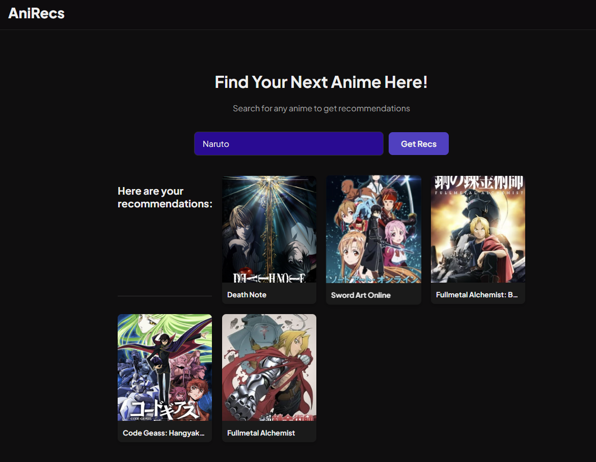

# AI-Powered Anime Recommendation Engine

  <!-- You can take a screenshot and upload it to your GitHub repo -->

A full-stack web application that provides personalised anime recommendations using a k-Nearest Neighbors collaborative filtering model.

---

## Table of Contents
- [Features](#features)
- [Tech Stack](#tech-stack)
- [How It Works](#how-it-works)
- [Setup and Installation](#setup-and-installation)

---

## Features

- **Collaborative Filtering:** Recommends anime by finding titles that similar users have enjoyed.
- **Dynamic Frontend:** A responsive, single-page application built with vanilla JavaScript that feels fast and modern.
- **Third-Party API Integration:** Enriches recommendations with live cover art and data from the Jikan (MyAnimeList) API.
- **REST API:** A backend built with Flask that serves the machine learning model's predictions.

---

## Tech Stack

- **Backend:** Python, Flask, Pandas, Scikit-learn
- **Frontend:** HTML5, CSS3, Vanilla JavaScript (ES6+)
- **Machine Learning Model:** k-Nearest Neighbors (k-NN) on a SciPy Sparse Matrix
- **APIs:** Custom REST API, Jikan API
- **Development:** Git, venv

---

## How It Works

The recommendation engine is built on the principles of collaborative filtering.

1.  **Data Processing:** The model is trained on the "Anime Recommendations Database" from Kaggle, which contains user ratings for thousands of anime. The data is filtered to create a dense user-item matrix of users who have rated many anime and anime that have been rated many times.
2.  **Model Training:** A `NearestNeighbors` model from Scikit-learn is trained on this matrix. It learns the "distance" between each anime based on shared user rating patterns.
3.  **API Service:** A Flask server loads the trained model. When a user requests recommendations for an anime, the API finds that anime's closest neighbors in the model and returns a list of their titles as JSON.
4.  **Frontend Interaction:** The JavaScript frontend calls this API, then makes subsequent calls to the Jikan API to fetch cover images for each title before dynamically rendering the results on the page.

---

## Setup and Installation

To run this project locally:

1.  **Clone the repository:**
    ```bash
    git clone https://github.com/cndozi18/anime_recommender.git
    cd anime_recommender
    ```
2.  **Create and activate a virtual environment:**
    ```bash
    python -m venv venv
    source venv/Scripts/activate  # On Windows (Git Bash)
    # source venv/bin/activate    # On macOS/Linux
    ```
3.  **Install dependencies:**
    ```bash
    pip install -r requirements.txt
    ```
4.  **Run the Flask application:**
    ```bash
    python app.py
    ```
5.  **View the application:**
    Open your browser and navigate to `http://127.0.0.1:5000/`.